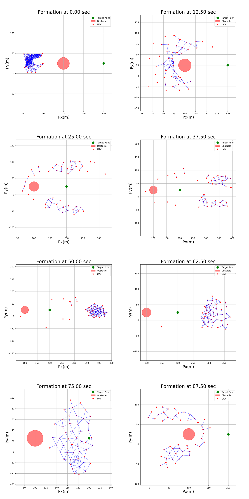

[🇨🇳 中文文档](#chinese) | [🇺🇸 English](#english)

<a id="chinese"></a>
# UAV编队控制算法实现

[](https://www.python.org/) [](https://numpy.org/) [](https://matplotlib.org/) [](https://opensource.org/licenses/MIT)

**本项目是对论文[Flocking for Multi-Agent Dynamic Systems: Algorithms and Theory]中提出的多智能体编队控制算法的实现**。

> 本项目基于[MSN-Flocking-Formation-Control](https://github.com/paul-shuvo/MSN-Flocking-Formation-Control)，并进行了一系列改进和优化。

## 效果展示

### 编队过程
<div align="center">

</div>

### 轨迹图
<div align="center">

</div>

## 项目改进

相比原始项目，本实现做了以下改进：

1. **可视化增强**：
   - 统一了图形尺寸为正方形，提高了可视化效果
   - 添加了字体大小设置，使图表更加清晰
   - 改进了图例显示和标签设置

2. **轨迹跟踪优化**：
   - 添加了轨迹图生成功能，可以观察UAV从起点到当前位置的完整移动路径
   - 实现了动态绘图范围计算，确保所有UAV和目标点都在视图内

3. **障碍物避障增强**：
   - 优化了障碍物避障算法的实现
   - 改进了障碍物的可视化表示

4. **代码结构优化**：
   - 模块化设计，将不同功能分离为独立函数
   - 添加了详细的注释，提高代码可读性

## 开始使用

### 环境要求
- Python 3.7+
- NumPy
- Matplotlib
- PIL (用于图像拼接)

### 安装依赖

```bash
pip install numpy matplotlib pillow
python Flocking_Formation_Control.py
```

## 项目参数

- UAV节点数量: N = 50
- 空间维度: M = 2
- 节点间期望距离: D = 15
- 缩放因子: K = 1.2 
- 交互范围 R = K*D
- 时间步长: DELTA_T = 0.009
- 迭代次数: ITERATION = 1000

## 变量命名

为了便于理解变量命名与论文中的公式保持一致。例如：

- C1_ALPHA 对应论文中的 c₁ᵅ
- phi_alpha 对应论文中的 φᵅ
- 等等

## 功能说明

本项目实现了带有障碍物避障的UAV编队控制算法主要功能包括：

1. **编队形成**：
   - 随机初始化UAV位置
   - 实现基于人工势场的编队控制

2. **目标点跟踪**：
   - UAV群体可以跟踪指定的目标点

3. **障碍物避障**：
   - 实现了基于β-代理的障碍物避障算法
   - 支持圆形障碍物

4. **可视化与分析**：
   - 生成编队快照
   - 绘制UAV轨迹图
   - 分析速度变化
   - 监测系统连通性
   - 跟踪质心轨迹

## 输出结果

运行程序后将在`snapshots`目录下生成以下图像：

1. 编队快照：记录不同时刻的UAV编队状态
2. 轨迹图：展示UAV的移动轨迹
3. 速度图：分析UAV速度随时间的变化
4. 连通性图：展示系统连通性随时间的变化
5. 质心轨迹图：展示整个系统质心的移动轨迹

## 辅助工具

项目包含两个辅助工具用于图像处理：

1. `create_montage.py`：将多个快照拼接成一个大图
2. `create_montage2.py`：更灵活的图像拼接工具，支持指定图像前缀

## 致谢

本项目基于[MSN-Flocking-Formation-Control](https://github.com/paul-shuvo/MSN-Flocking-Formation-Control)，感谢原作者的工作。


---

[🇨🇳 中文文档](#chinese) | [🇺🇸 English](#english)

<a id="english"></a>
# UAV Flocking Formation Control Algorithm

[](https://www.python.org/) [](https://numpy.org/) [](https://matplotlib.org/) [](https://opensource.org/licenses/MIT)

**This project implements the multi-agent flocking formation control algorithm proposed in the paper [Flocking for Multi-Agent Dynamic Systems: Algorithms and Theory]**.

> This project is based on [MSN-Flocking-Formation-Control](https://github.com/paul-shuvo/MSN-Flocking-Formation-Control) with a series of improvements and optimizations.

## Results Display

### Formation Process
<div align="center">

</div>

### Trajectory Plot
<div align="center">

</div>

## Improvements

Compared to the original project, this implementation has made the following improvements:

1. **Enhanced Visualization**:
   - Unified figure size to square format for better visual effect
   - Added font size settings for clearer charts
   - Improved legend display and label settings

2. **Trajectory Tracking Optimization**:
   - Added trajectory plotting functionality to observe the complete movement path of UAVs from start to current position
   - Implemented dynamic plotting range calculation to ensure all UAVs and target points are within view

3. **Obstacle Avoidance Enhancement**:
   - Optimized the implementation of obstacle avoidance algorithm
   - Improved the visual representation of obstacles

4. **Code Structure Optimization**:
   - Modular design, separating different functionalities into independent functions
   - Added detailed comments to improve code readability

## Getting Started

### Requirements
- Python 3.7+
- NumPy
- Matplotlib
- PIL (for image montage)

### Installation

```bash
pip install numpy matplotlib pillow
python Flocking_Formation_Control.py
```

## Project Parameters

- Number of UAV nodes: N = 50
- Space dimensions: M = 2
- Desired distance between nodes: D = 15
- Scaling factor: K = 1.2
- Interaction range: R = K*D
- Time step: DELTA_T = 0.009
- Number of iterations: ITERATION = 1000

## Variable Naming

For easier understanding, variable names are consistent with the formulas in the paper. For example:

- C1_ALPHA corresponds to c₁ᵅ in the paper
- phi_alpha corresponds to φᵅ in the paper
- etc.

## Features

This project implements UAV flocking formation control with obstacle avoidance. Main features include:

1. **Formation Control**:
   - Random initialization of UAV positions
   - Implementation of artificial potential field-based formation control

2. **Target Tracking**:
   - UAV swarm can track specified target points

3. **Obstacle Avoidance**:
   - Implementation of β-agent based obstacle avoidance algorithm
   - Support for circular obstacles

4. **Visualization and Analysis**:
   - Generation of formation snapshots
   - Plotting of UAV trajectories
   - Analysis of velocity changes
   - Monitoring of system connectivity
   - Tracking of center of mass trajectory

## Output Results

After running the program, the following images will be generated in the `snapshots` directory:

1. Formation snapshots: Recording UAV formation states at different times
2. Trajectory plots: Showing UAV movement paths
3. Velocity plots: Analyzing UAV velocity changes over time
4. Connectivity plots: Showing system connectivity changes over time
5. Center of mass trajectory plot: Showing the movement trajectory of the entire system's center of mass

## Utility Tools

The project includes two utility tools for image processing:

1. `create_montage.py`: Combines multiple snapshots into one large image
2. `create_montage2.py`: More flexible image montage tool, supporting specified image prefixes

## Acknowledgements

This project is based on [MSN-Flocking-Formation-Control](https://github.com/paul-shuvo/MSN-Flocking-Formation-Control). Thanks to the original author for their work.

